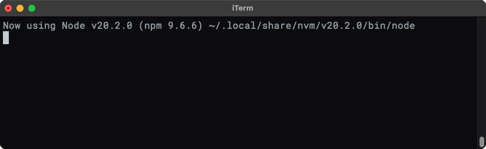
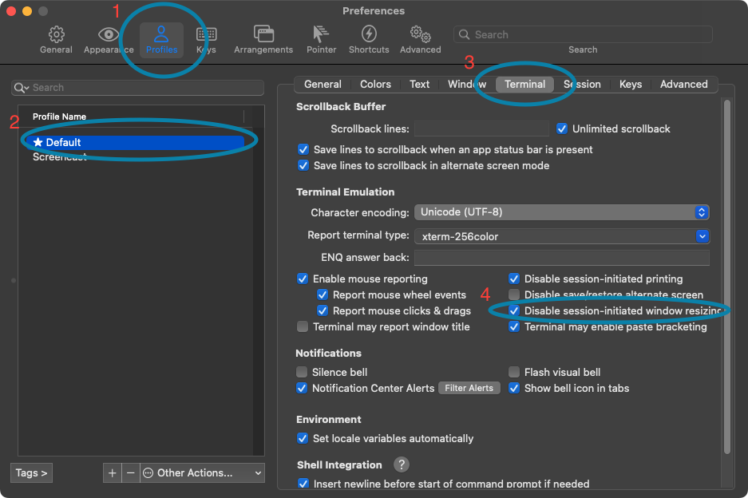

# Automatic CLI Gif recorder

This repo is a combination of tools to make it easy to record gifs of your terminal from automated scripts.

Never again record a bunch of helpful commands, only to realize you forgot to record something in the middle, or that you made a typo somewhere and then have to painstakingly re-record everything!

Prereqs:

- [`just`](https://github.com/casey/just) - a command runner
- [`ttyrec`]() - a terminal recorder
- [`ttygif`]() - a terminal to gif converter


`just`, `ttyrec`, and `ttygif` are all available via homebrew on macos, install with:

```sh
$ brew install just ttyrec ttygif
```

*Note: `just` is not strictly required. It's a task runner and you can run the commands directly if necessary.*

## Installation

Clone this repo

```
$ git clone github.com/jsoverson/auto-cli-gif
```

## Usage

1) First, initialize submodules to get the `demo-magic` script

```
$ just init
```

2) Add scripts to the `scripts/` directory

3) Record!

```sh
$ just record
```

4) View your recordings in the `recordings/` directory



## Customization

Edit the `src/SCRIPT_SETUP.sh` or the `src/SCRIPT_TEARDOWN.sh` files to customize what runs before and after every script in `scripts/`

Typically you'll want to setup the prompt and typing speed and end your recordings in a consistent way. This is where you'll do it.

## Debugging

Run `just debug` to see your commands execute without being recorded or turned into a GIF.

```sh
$ just debug scripts/hello-world.sh
```

## FAQ

### How can I simulate typing?
### What is `pei`?
### What is `demo-magic`?

This repo uses the awesome `demo-magic` script from [paxtonhare/demo-magic](https://github.com/paxtonhare/demo-magic) to simulate typing and other useful effects.

Check out the [demo-template](https://github.com/paxtonhare/demo-magic/blob/master/samples/demo-template.sh) for more tips.

### I get a lot of shell/autocomplete/other noise

It's best to use a terminal profile that is as close to default settings as possible. That means starting up a shell that typically doesn't source rc settings.

This is different for every terminal emulator, but is usually as simple as using your default shell without rc files (e.g. `zsh -d -f` ) and sourcing a custom, recording-oriented configuration file (e.g. `source ~/.zshrc-recording`).

Terminal emulators like `iterm2` support this well with their "Profiles" feature.

### My terminal isn't resizing, what do I do?

If you're using iterm2, you need to disable a default setting:



If you're using another terminal, you probably need to find a similar setting. The `resize` function uses standard shell escapes to resize the terminal.

### How do I stop the iterm2 titlebar from showing the different commands?

Add this to your .zshrc

```sh
function title {
    echo -ne "\033]0;"$*"\007"
}

title "terminal"⏎
```